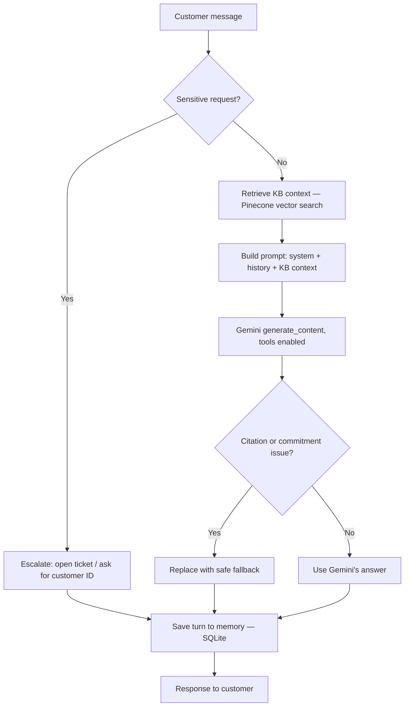

# SupportPilot AI

A customer support chatbot built phase by phase, from a single Gemini API
call to a full RAG + tools + guardrails + evals pipeline — with nothing
skipped or hand-waved. Built as a public learning log: every phase, every
bug, and every fix is documented as it actually happened, not cleaned up
after the fact.

[](https://www.python.org/)
[](LICENSE)

## Demo

<!--
  Add your demo video here once recorded. Two common options:
  1. Upload to YouTube/Loom and link a thumbnail:
     [](https://your-video-url)
  2. Embed a GIF directly (GitHub renders these inline):
     
-->
*🎥 Demo video coming soon.*

## What it does

SupportPilot AI answers customer support questions grounded in a real
knowledge base (with citations, not guesses), looks up customer accounts
and opens support tickets via tool calling, remembers conversation
context across turns, and escalates sensitive requests to a human
instead of freelancing an answer — with an automated eval suite to catch
regressions instead of eyeballing it.

## How it works



## Built in 12 phases

Starting from one Gemini API call and adding a single capability at a
time — RAG (keyword search, then Pinecone vector search), memory, tool
calling, MCP, guardrails, evals, Docker. Full breakdown of every phase,
including what got adapted from the original plan and why, in
**[PHASE_PLAN.md](PHASE_PLAN.md)**.

## Quick start (local)

```bash
uv sync
cp .env.example .env      # add your GEMINI_API_KEY and PINECONE_API_KEY
uv run python seed_crm.py
uv run python ingest_kb.py
uv run uvicorn api:app --reload
```
Open http://localhost:8000. Full setup (CLI mode, Docker, tests, evals)
in **[SETUP.md](SETUP.md)**.

## Deploy to the cloud

Deploys to Google Cloud Run in one command. Full step-by-step guide —
including the persistence tradeoffs worth knowing before you deploy —
in **[DEPLOYMENT.md](DEPLOYMENT.md)**.

## Read the deep dive

I wrote up the full build — the decisions, the bugs, and the fixes — on
Medium: **[Read it here →](https://medium.com/@your-username/your-post-slug)**

## License

MIT — see [LICENSE](LICENSE).
